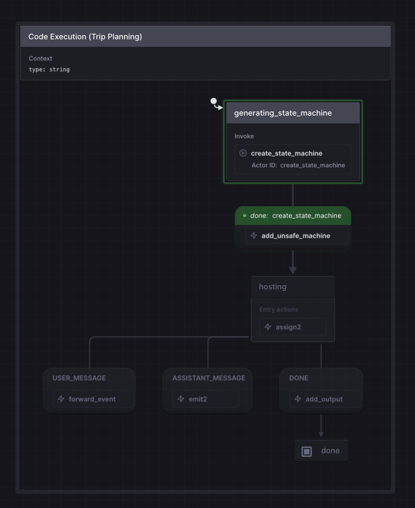

# Code Execution

[Watch Demo](https://youtu.be/JLmwVVF8Wog)

Agent generates a new state machine definition and then immediately hosts that machine as a child actor. The LLM is tasked to generate the "body" of the state machine definition, which defines the flow/process. The prompt includes stubs of available actions and actors as well as types to improve output.

```typescript
const generatedMachine = setup({
    // This section is injected by the parent to the child and stubs provided in the prompt to improve outputs
    types: {
        input: {},
        output: {},
        context: {},
    },
    actions: {},
    actors: {},
}).createMachine({
    // This section is generated by the LLM
    context: {}
    states: {}
})
```