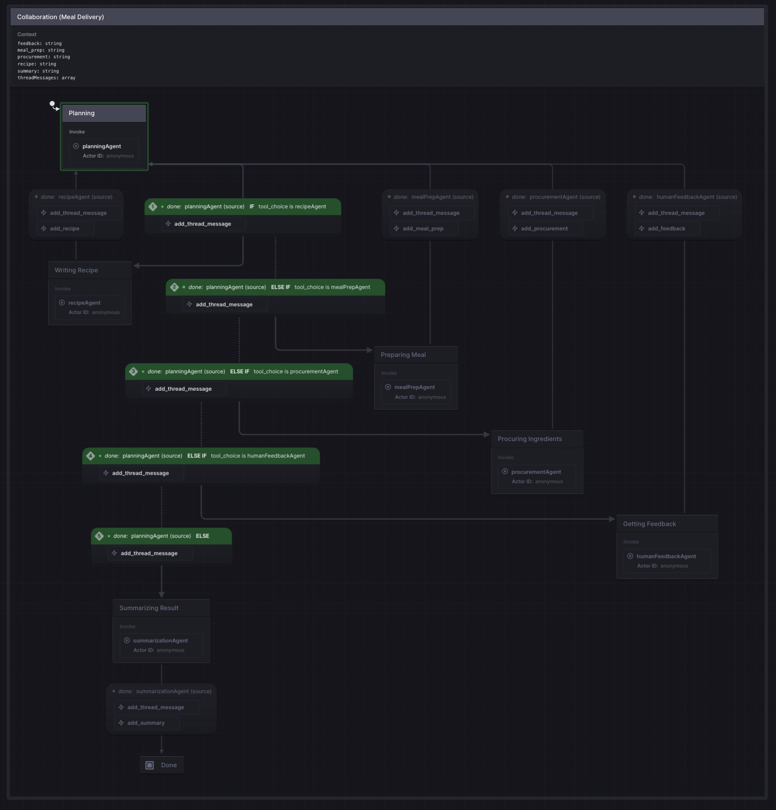

# Collaboration
[Watch Demo (YouTube)](https://www.youtube.com/watch?v=DhrkfXZoD2M)

Multiple agents collaborating together to produce a single artifact—in this example a JSON object containing a recipe, customer feedback, meal prep info, and other child agent output.

A Routing Agent capable of understanding what other agents are available for use and what work has been completed so far directs each next action in the flow.

A Summarization Agent is the last step of the flow, which analyzes the latest context and produces a human-readable summary.