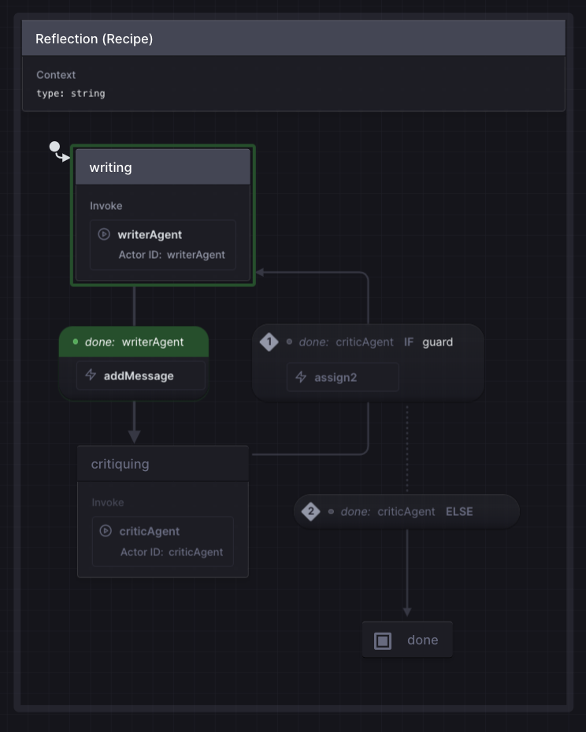

Writer and Critic in loop with configurable number of turns to refine the output based on feedback.

Consider scenarios where the critic agent manages its own long-running, multi-agent workflow—a team of critics with diverse focus areas.